# BookIt
### PMPML Ticket Booking App
- Pune is sprawling city and city transportation system is evolving day to day. As the
system evolves the need to digitalize all the transactions becomes need of the hour.
This project which is implemented on Android platform helps to manage bus
scheduling and bookings. This PMPML Bus Booking App is an integrated end-to-end
system starting from searching bus routes to book them.
- PMPML Bus Booking System is an android based application which is connected to a
database. The database includes information about buses, no. of seats available,
occupancy, availability, days and time of operation, no. of buses from point ‘A’ to
point ‘B’, Price etc. The database is updated time to time and a user can reserve his
ticket from any part of the world and any time.

### Motivation

As a student it is very difficult for me to keep a track of timings of
various PMPML buses and I also realized that the same problem is
faced by many native people and most of the college students.
Keeping this in mind, we created a PMPML ticket booking app.
With the help of this app , the students, native people and the
people who don’t have any idea about the city transportation
system can book a ticket at desired time

###      &emsp;&emsp;&emsp; Start Activity  &emsp;&emsp;&emsp;&emsp;&emsp;&emsp;&emsp;  Login Activity  &emsp;&emsp;&emsp;&emsp;&emsp;&emsp;  Register Activity

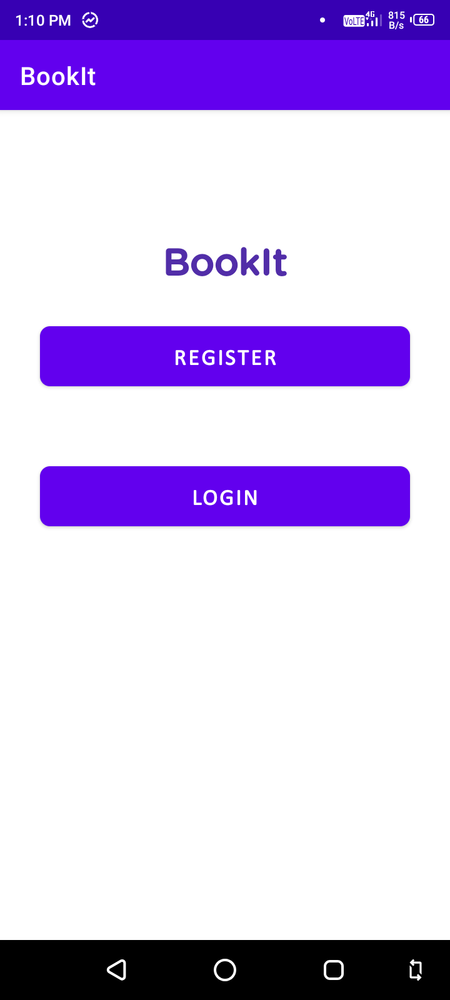
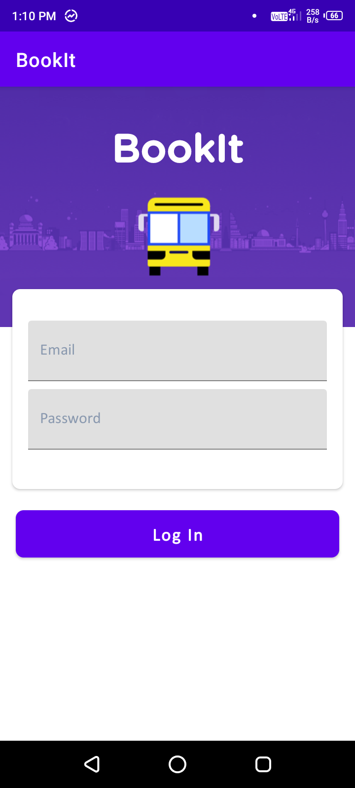
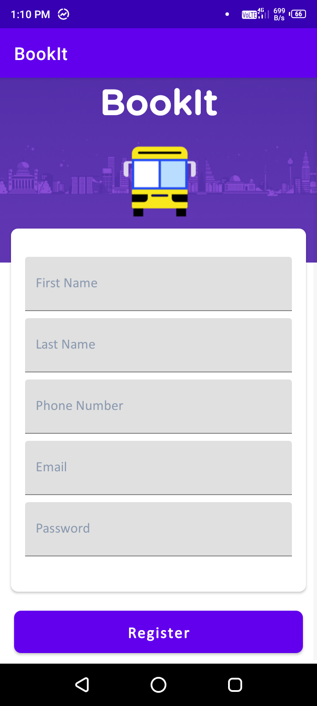

## Functionalities
1. Can make a profile.
2. Select a bus at desired date.
3. Select desired bus timing and seat.
4. Can book a ticket
5. Can view his/her ticket history

### &emsp;&emsp;&emsp;&emsp;&emsp;&emsp;&emsp;&emsp;&emsp;&emsp; Main Activity 1 &emsp;&emsp;&emsp;&emsp;&emsp;&emsp;&emsp;&emsp;&emsp;&emsp;&emsp;&emsp;  Main Activity 2 

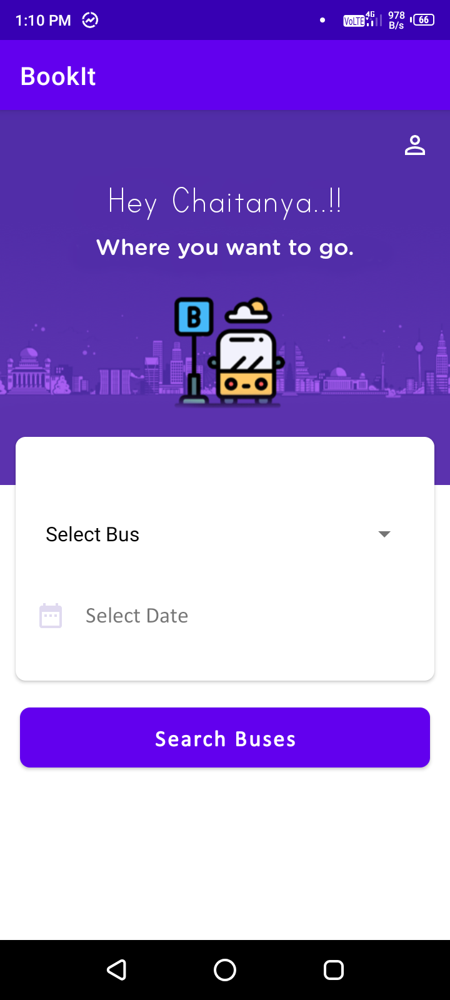
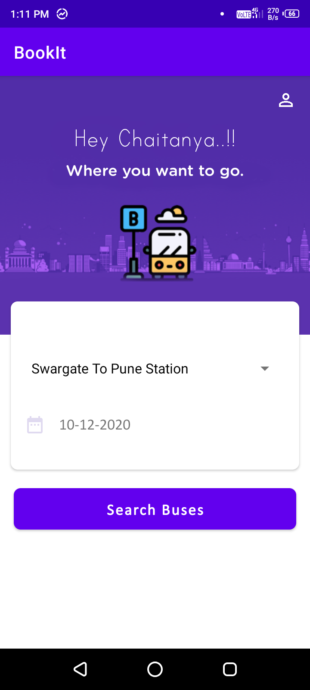
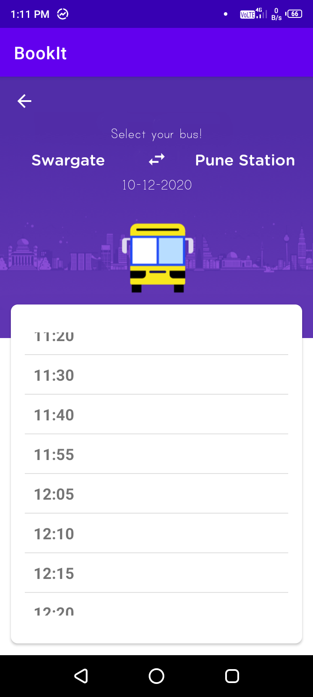

###      &emsp;&emsp;&emsp;&emsp;&emsp;&emsp;&emsp;&emsp;&emsp;&emsp; Main Activity 3  

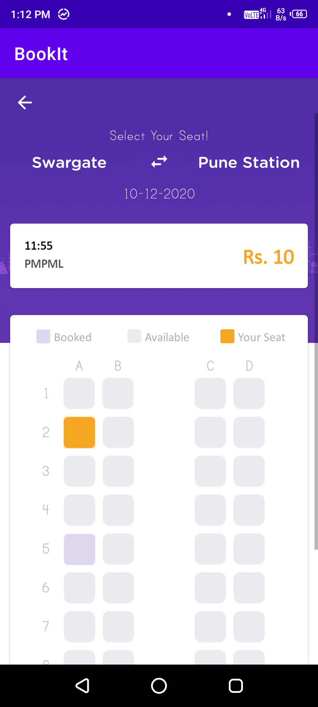
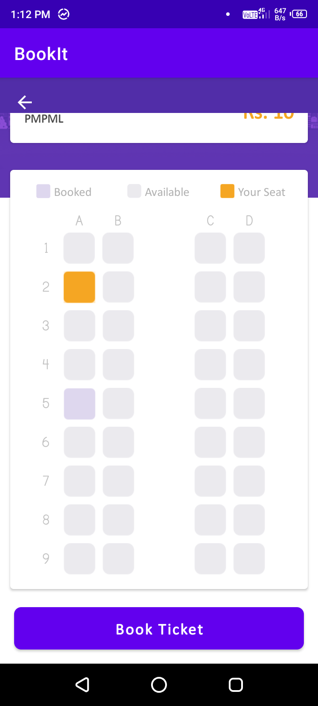

###      &emsp;&emsp;&emsp; Profile Activity  &emsp;&emsp;&emsp;&emsp;&emsp;&emsp;&emsp;  Ticket Activity  &emsp;&emsp;&emsp;&emsp;&emsp;&emsp;&emsp;  Edit Activity

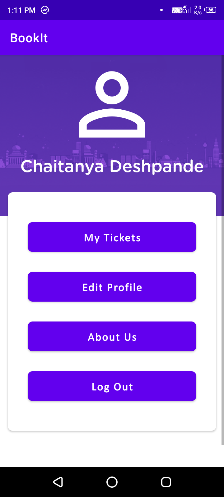
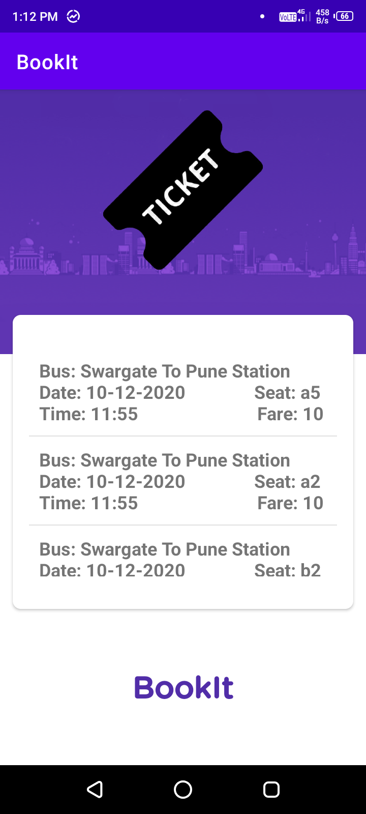
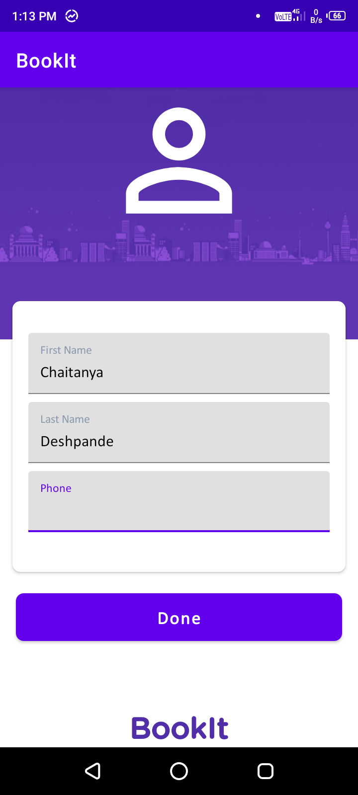

###      &emsp;&emsp;&emsp; About Activity  &emsp;&emsp;&emsp;&emsp;&emsp;&emsp;&emsp;  Logout Activity

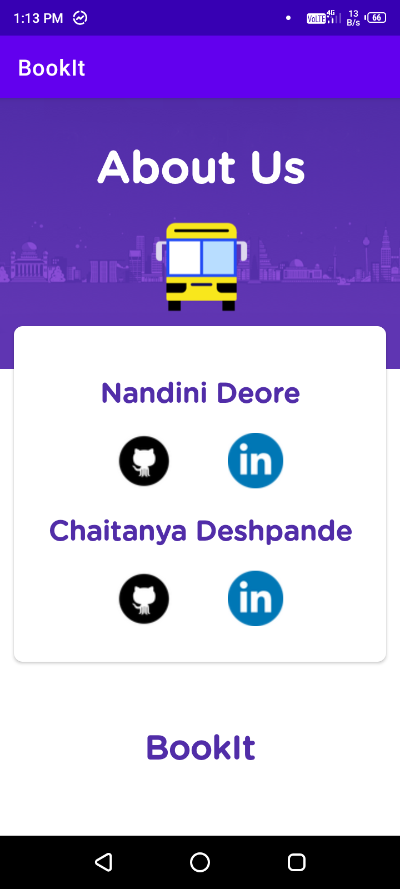
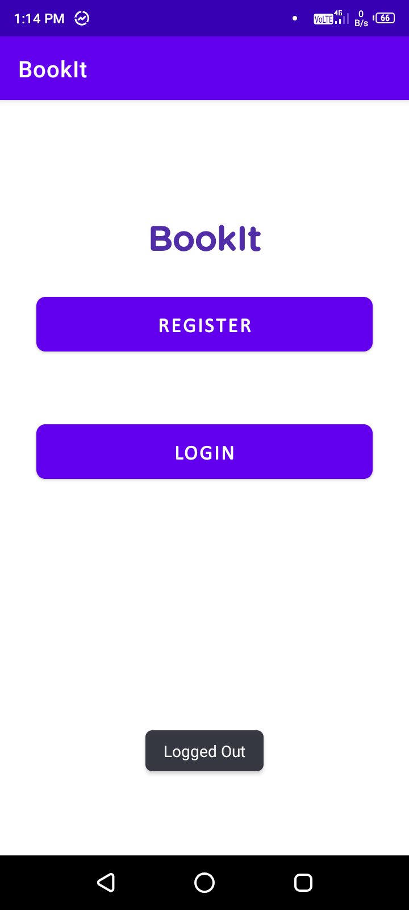

